# Ascend — Real-Life RPG

A gamified personal development application inspired by the hit anime "Solo Leveling". Ascend turns your real life into an RPG where you are the main character. Complete real-world habits and goals to earn XP, level up your Hunter Rank, and unlock achievements — all powered by a personalised AI quest engine.

---

## Screenshots

## Screenshots

<p align="center">
  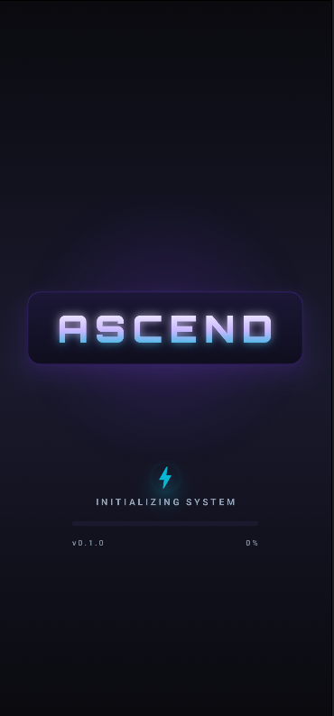
  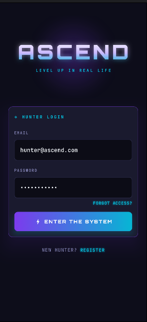
  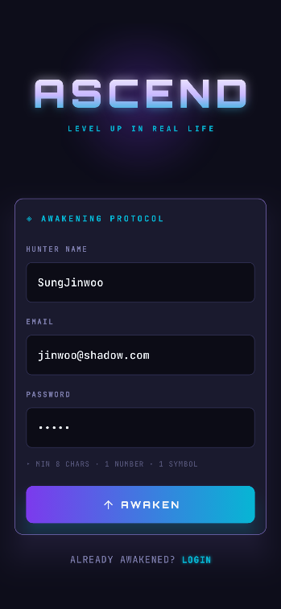
  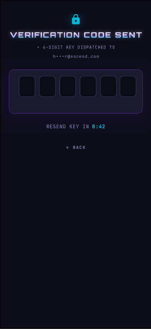
</p>

<p align="center">
  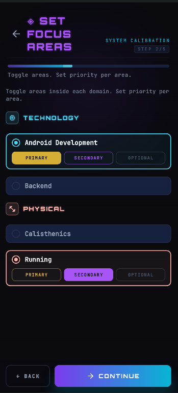
  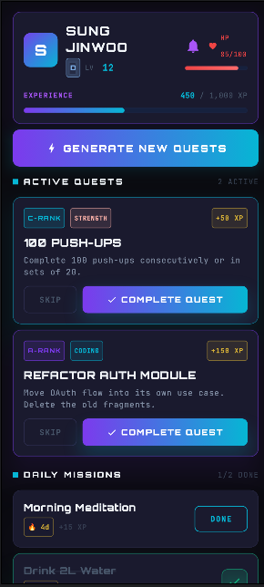
  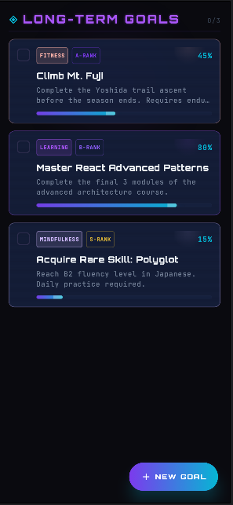
  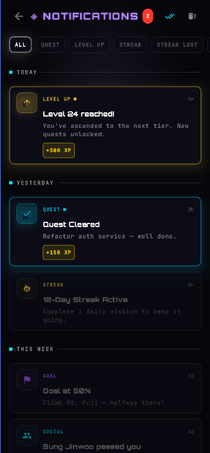
</p>

<p align="center">
  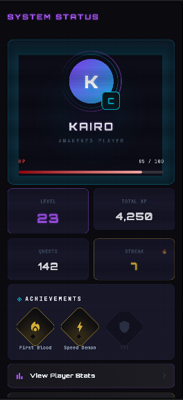
  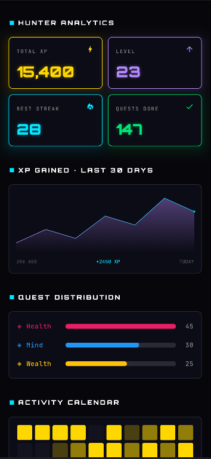
  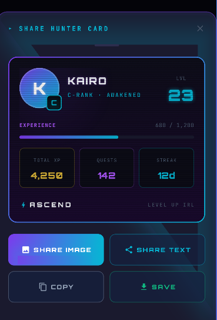
  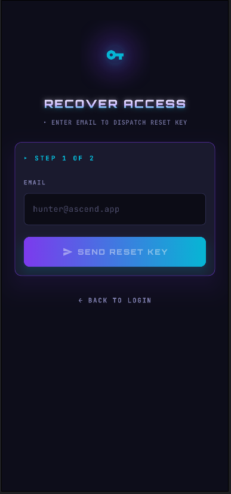
</p>

---

## Table of Contents

- [What is Ascend](#what-is-ascend)
- [Tech Stack](#tech-stack)
- [Architecture Overview](#architecture-overview)
- [Module Map](#module-map)
- [Setup & Development](SETUP_GUIDE.md)
- [API Reference](#api-reference)
- [Security Model](#security-model)

---

## What is Ascend

**Ascend turns your daily habits and personal goals into a fully-fledged RPG.** 

Instead of another boring to-do list, Ascend treats *you* as the main character. Every task you complete grants Experience Points (XP). Reach XP thresholds to level up your Hunter Rank and unlock achievements.

What truly sets Ascend apart is its **Personalised AI Quest Engine**. The system analyses your long-term goals and quest history using advanced Retrieval-Augmented Generation (RAG) to generate daily and weekly challenges tailored specifically to where you are in your journey. 

### Highlight Features

- **Memory-Driven AI Quests:** The system remembers your past accomplishments and dynamically adjusts difficulty. It never repeats itself, acting like a true Dungeon Master for your life.
- **GitHub-Style Heatmaps & Deep Analytics:** Visualize your consistency with beautiful activity heatmaps and track your distribution of effort across Health, Mind, and Wealth domains.
- **Offline-First Architecture:** Powered by a robust Room database locally, the app feels instantaneously snappy and seamlessly syncs to the backend in the background.
- **Proprietary Custom ML Model:** Powered by a centralized, fine-tuned machine learning pipeline. Your personal data stays entirely within the Ascend ecosystem for complete privacy.
- **Dynamic Achievements & Sharing:** Earn stylish diamond badges for your milestones and share your Hunter Card with friends to show off your rank and streaks.

**Core loop:**
1. Set goals (fitness, learning, mindfulness, creativity)
2. Complete AI-generated quests and daily habits
3. Earn XP, level up, unlock titles
4. The AI remembers your history and dynamically evolves your next quests

---

## Tech Stack

| Layer | Technology |
|---|---|
| Android client | Kotlin · Jetpack Compose · MVI · Room · Retrofit |
| Go API | Go 1.23 · Chi router · JWT |
| AI / ML | Python · FastAPI · LangChain · Custom ML Model |
| Database | PostgreSQL 16 · pgvector (semantic search) |
| Cache & streams | Redis 7 · Redis Streams (async event processing) |
| Containerisation | Docker · Docker Compose |
| Cloud (free) | Railway (no credit card required) |

---

## Architecture Overview

```
Android app (Kotlin/Compose)
    │
    │  REST + WebSocket (JWT auth)
    ▼
Go API Gateway (port 8080)
    │  validates, persists, publishes
    ├──► Redis Streams ──► XP Worker (Go) ──► PostgreSQL
    │                  ──► RAG Worker (Python) ──► pgvector
    │
    ├──► PostgreSQL (users, quests, habits, goals, progress_logs)
    │
    └──► Python RAG Service (port 8001)
             │  LangChain + vector similarity search
             └──► Custom ML Model Inference
```

**Key design decisions:**

- **API-first**: the Go backend is completely decoupled from the Android client via REST contracts
- **Async by default**: quest completion returns in <15ms; XP calculation, embedding, and notifications are async via Redis Streams
- **Offline-first Android**: Room cache serves UI instantly; network sync happens in background
- **RAG memory**: every completed quest and goal is embedded into pgvector; the AI retrieves semantically relevant history before generating new quests — it never repeats itself

---


## Setup & Development

Detailed instructions for local setup, environment configuration, troubleshooting, and development commands are available in the **[Setup Guide](SETUP_GUIDE.md)**.

---

## API Reference

All endpoints are prefixed with `/api/v1`.

### Authentication

| Method | Endpoint | Auth | Description |
|---|---|---|---|
| POST | `/auth/register` | None | Register — sends email OTP |
| POST | `/auth/verify-email` | None | Verify OTP code |
| POST | `/auth/resend-otp` | None | Resend OTP code |
| POST | `/auth/login` | None | Login — returns access token |
| POST | `/auth/refresh` | Cookie | Rotate refresh token |
| POST | `/auth/logout` | Cookie | Invalidate session |

### User

| Method | Endpoint | Auth | Description |
|---|---|---|---|
| GET | `/me` | JWT | Get current user profile |

### Goals

| Method | Endpoint | Auth | Description |
|---|---|---|---|
| GET | `/goals` | JWT | List active goals |
| POST | `/goals` | JWT | Create a goal |
| PATCH | `/goals/:id` | JWT | Update a goal |
| DELETE | `/goals/:id` | JWT | Soft-delete a goal |

### Habits

| Method | Endpoint | Auth | Description |
|---|---|---|---|
| GET | `/habits` | JWT | List active habits |
| POST | `/habits` | JWT | Create a habit |
| POST | `/habits/:id/complete` | JWT | Check in (idempotent) |

### Quests

| Method | Endpoint | Auth | Description |
|---|---|---|---|
| GET | `/quests` | JWT | List active quests |
| POST | `/quests/:id/complete` | JWT | Complete a quest |
| POST | `/quests/:id/skip` | JWT | Skip a quest |
| POST | `/quests/generate` | JWT | AI-generate new quests (rate-limited: 3/day) |

### Health

| Method | Endpoint | Auth | Description |
|---|---|---|---|
| GET | `/health` | None | Liveness check |
| GET | `/ready` | None | Readiness check (DB + Redis) |

### WebSocket

| Endpoint | Auth | Description |
|---|---|---|
| `ws://host/api/v1/ws` | JWT header | Real-time event stream |

**WebSocket frame types:**

```json
{"type": "LEVEL_UP",    "payload": {"new_level": 13, "xp_awarded": 125}}
{"type": "XP_AWARDED",  "payload": {"amount": 40}}
{"type": "GUILD_QUEST", "payload": {"member_name": "...", "quest_title": "..."}}
```

---

## Security Model

### Authentication flow

```
Register → email OTP sent → verify OTP → account active → login → JWT + refresh cookie
```

- Access tokens: 15 minutes, HS256
- Refresh tokens: 7 days, stored as SHA-256 hash in Redis (never plaintext)
- Refresh rotation: old token is invalidated the moment a new one is issued
- Cookies: `HttpOnly`, `Secure`, `SameSite=Strict`

### Account protection

- **Login lockout**: 5 failed attempts within 15 minutes → account locked for 30 minutes
- **OTP rate limit**: max 3 OTP requests per 15-minute window per email
- **OTP single-use**: each code is deleted from Redis the moment it is verified
- **CORS**: exact allow-list only — no wildcard, `Vary: Origin` always set
- **HMAC request signing**: every mutating request includes `X-Timestamp` and `X-Signature`; backend rejects requests older than 5 minutes

### Password requirements

- Minimum 8 characters
- At least one uppercase letter
- At least one number
- Maximum 128 characters
- Stored as bcrypt hash at cost factor 12

---

## Project Structure

```
ascend/
├── backend/                  Go API server
│   ├── cmd/server/           main.go — entrypoint
│   ├── cmd/worker/           worker entrypoint (XP consumer)
│   ├── internal/
│   │   ├── auth/             JWT, bcrypt, session, OTP handlers
│   │   ├── email/            SMTP sender
│   │   ├── events/           Redis Streams publisher + consumer
│   │   ├── game/             XP engine, levelling formula
│   │   ├── goal/             goal HTTP handlers
│   │   ├── habit/            habit HTTP handlers
│   │   ├── middleware/        CORS, JWT guard, rate limit, HMAC, logger
│   │   ├── otp/              OTP generate + verify
│   │   ├── quest/            quest handlers + expiry worker
│   │   ├── server/           router wiring
│   │   ├── store/            repository interfaces + Postgres/Redis impls
│   │   ├── validators/       input validation
│   │   └── workers/          XP background worker
│   └── pkg/
│       ├── config/           env config loader
│       ├── logger/           structured slog setup
│       └── response/         JSON envelope helpers
│
├── rag-service/              Python AI service
│   ├── app/
│   │   ├── model/            Custom ML model inference adapters
│   │   ├── prompts/          versioned prompt templates
│   │   ├── context_builder   user context assembler
│   │   ├── document_builder  quest → embeddable text
│   │   ├── embedder          embedding model + pgvector store
│   │   ├── generate          full RAG pipeline
│   │   ├── retriever         cosine search + MMR reranking
│   │   └── worker            Redis queue consumer
│   └── tests/
│
├── android/                  Kotlin/Compose app
│   └── app/src/main/java/com/ascend/app/
│       ├── data/
│       │   ├── local/        Room database, DAOs, entities, DataStore
│       │   ├── realtime/     WebSocketManager
│       │   ├── remote/       Retrofit services, DTOs, interceptors
│       │   └── repository/   offline-first repositories
│       ├── di/               Hilt modules
│       ├── domain/model/     pure Kotlin domain models
│       └── ui/
│           ├── auth/         login, register, OTP screens
│           ├── components/   shared components (StatBar, QuestCard, etc.)
│           ├── dashboard/    main game screen
│           ├── goals/        goal management
│           ├── levelup/      LevelUpModal with particle system
│           ├── navigation/   NavGraph, routes, bottom nav
│           ├── profile/      user profile + logout
│           ├── splash/       auto-login routing
│           └── theme/        colors, typography, shapes, gradients
│
├── migrations/               numbered SQL migration files (golang-migrate)
├── scripts/                  seed.sql, dev-tunnel.sh
├── docker-compose.yml        full local stack
├── Makefile                  dev task runner
└── .env.example              environment template
```

---

*Ascend — Level up your real life.*
